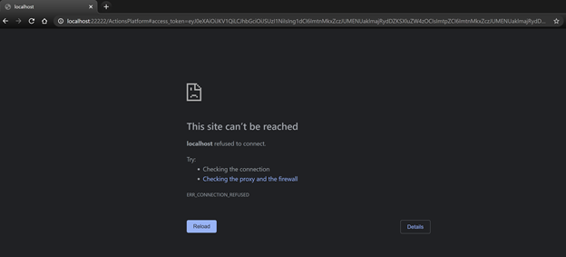

# Action Package deployment PowerShell script

# Prerequisites

To begin, you will need:
* A Microsoft 365 subscription
* A team with the users who will be sending Polls using this app. (You can add and remove team members later!)
* A copy of the Poll app GitHub repo.

# Step 1: Create your Poll app

To create the Teams Poll app package:
1. Make sure you have cloned (not downloaded) the app repository locally. If you are not able to clone the repository, then follow the steps mentioned in troubleshooting section.
1. Navigate to PreCompiledApp folder.
1. Open the actionManifest.json file in a text editor.
1. Change the placeholder fields in the manifest to values appropriate for your organization.
    * packageID - A unique identifier for this app in reverse domain notation. E.g: com.contoso.pollapp. (Max length: 64)
    * developer.[]()name ([What's this?](https://docs.microsoft.com/en-us/microsoftteams/platform/resources/schema/manifest-schema#developer))
    * developer.websiteUrl
    * developer.privacyUrl
    * developer.termsOfUseUrl
1. Zip all the content in the PreCompiledApp folder and name the zip file as "MSTeamsPoll.zip".


Note: Make sure you do not change to file structure of the PreCompiledApp folder, with no new nested folders.
<br/>

# Step 2: Deploy app to your organisation

1. Open a Windows PowerShell console on your windows machine.
1. If you have downloaded the app repository (not cloned), then you would need to set executionPolicy to unrestricted using following command:
    ```
    Set-ExecutionPolicy -ExecutionPolicy Unrestricted -Force -Scope CurrentUser
    ```
1. Find PowerShell module named "ActionPackageDeploy.psm1" present in the cloned folder, copy its absolute path and run the following command in the Windows PowerShell console.

    ```
    import-module "<AbsolutePathFor_ActionPackageDeploy.psm1>"
    ```

    This command imports the Functions exported by ActionPackageDeploy.psm1 module, that are used in the next steps.

1. After importing the module, run the below command to deploy the app package to your Microsoft 365 subscription. Replace <AbsolutePath for MSTeamsPoll.zip> in following command, with the absolute path for "MSTeamsPoll.zip" folder created in Step1.

    ```
    New-ActionPackage -PackageZipFilePath "<AbsolutePath for MSTeamsPoll.zip>"
    ```

    An AAD custom app, Bot are programmatically created in your tenant to power the Poll message extension app in Teams.

1. After successful execution of above command, a Poll Teams app zip file is generated at `<Home_Directory>\TeamsApp\microsoft-teams-appzip-upload.zip`.

<br/>

# Step 3: Run the app in Microsoft Teams

If your tenant has sideloading apps enabled, you can install your app by following the instructions [here](https://docs.microsoft.com/en-us/microsoftteams/platform/concepts/apps/apps-upload#load-your-package-into-teams).

You can also upload it to your tenant's app catalog, so that it can be available for everyone in your tenant to install. See [here](https://docs.microsoft.com/en-us/microsoftteams/tenant-apps-catalog-teams).

Upload the generated Poll Teams app zip file (the `microsoft-teams-appzip-upload.zip` generated in above step) to your channel, chat, or tenant’s app catalog.

<br/>

# Step 4: Update your Poll Teams app

If you want to update the existing Poll Teams app with latest functionality -
1. Make sure you have cloned the latest app repository locally.
1. Open the `actionManifest.json` file in a text editor.
    * Change the placeholder fields (`packageID`, `developer.name`, `developer.websiteUrl`, `developer.privacyUrl`, `developer.termsOfUseUrl`) in the manifest with existing values in your Poll Teams app.
    * Update the `version` field in the manifest. Make sure latest version number is higher than previous version number.
1. Zip all the content from the unzipped PreCompiledApp folder and name the zip file as "MSTeamsPoll.zip".
1. Run the following commands to update your Poll Teams app with the latest bits of code.

    ```
    import-module "<AbsolutePathFor_ActionPackageDeploy.psm1>"
    ```
    Then run following command: <br/>
    ```
    Update-ActionPackage -PackageZipFilePath "<AbsolutePathFor_MSTeamsPoll.zip_CreatedInLastStep>"
    ```
1. Your Poll app on Teams automatically gets updated to the latest version.

<br/><br/>

# Troubleshooting

## `MSAL.PS` PowerShell module installation failure

If `New-ActionPackage` command fails due to PowerShell module installation related errors then try following steps to acquire the AccessToken manually. You can provide this AccessToken as input parameter to the ```New-ActionPackage``` or ```Update-ActionPackage``` command.<br/><br/>

1. Open following url in browser and login to your AAD account when prompted.<br/>

    https://login.microsoftonline.com/common/oauth2/v2.0/authorize?response_type=token&response_mode=fragment&prompt=select_account&client_id=cac88df7-3599-49cf-9465-867b9eee33cf&redirect_uri=http://localhost:22222/ActionsPlatform&scope=https://actions.office365.com/ActionPackage.ReadWrite.All <br/>

1. After successful login, browser address bar will contain url similar to below screenshot.<br/>

    Url in your browser address bar has following format:
    ```
    http://localhost:22222/ActionsPlatform#access_token=<ACCESS_TOKEN>&token_type=Bearer&expires_in=3598&scope=https%3a%2f%2factions.office365.com%2fActionPackage.ReadWrite.All&session_state=...
    ```
    Copy the access_token value from this url.

1.  Set the AccessToken copied in above step as AccessToken Parameter in
`New-ActionPackage` or `Update-ActionPackage` command as follows.

    ```
    New-ActionPackage
            -PackageZipFilePath "<AbsolutePathFor_MSTeamsPoll.zip_CreatedInStep1>"
            -AccessToken "<AccessTokenCopiedFromAboveUrl>"
    ```

##